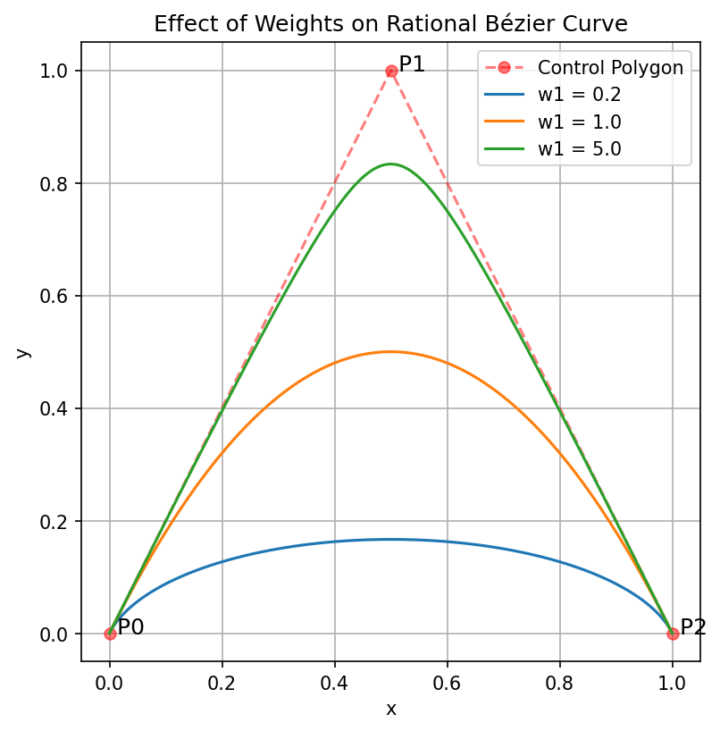
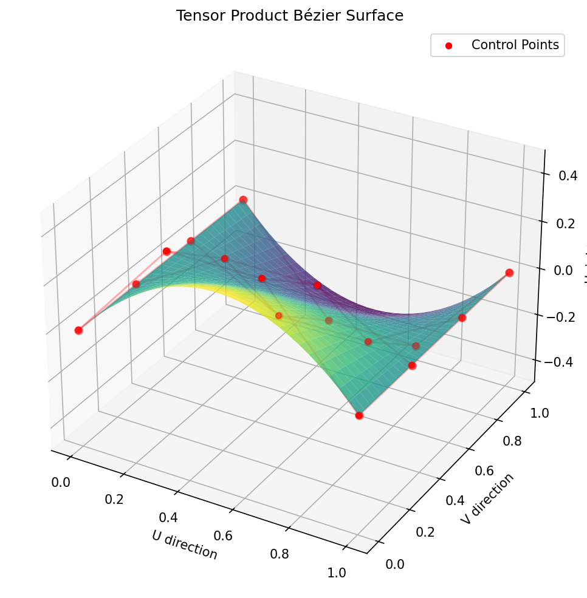
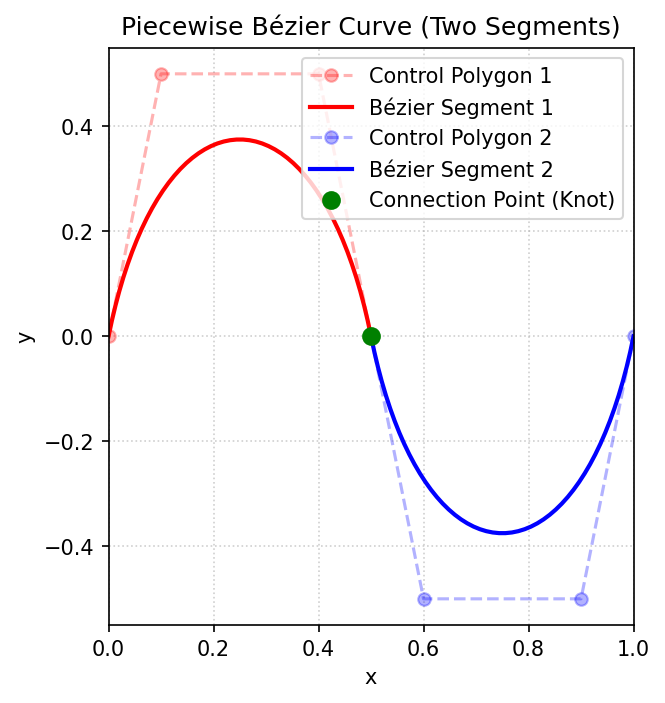

# NURBS BOOK 笔记

## 目录

- 1. 曲线曲面基础知识

    - [1.1 隐函数与参数函数](#11-隐函数与参数函数)

    - [1.2 贝塞尔曲线 (Bézier Curves)](#12-贝塞尔曲线-bézier-curves)

    - [1.3 有理贝塞尔曲线 (Rational Bézier Curves)](#13-有理贝塞尔曲线-rational-bézier-curves)

    - [1.4 张量积曲面 (Tensor Product Surfaces)](#14-张量积曲面-tensor-product-surfaces)

- 2. B 样条基函数

    - [2.1 B样条基函数的定义](#21-b-样条基函数的定义)

    - [2.2 B样条基函数的导数与性质](#22-b-样条基函数的导数与性质)

## 1. 曲线曲面基础知识

### 1.1 隐函数与参数函数

**隐函数形式 (Implicit Form)：**
$$
f(x, y) = 0
$$

**参数函数形式 (Parametric Form)：**
$$
\mathbf{C}(u) = \bigl( x(u), y(u) \bigr), \quad u \in [a, b]
$$

参数表达通常是不唯一的。例如，对于单位圆，可以有以下两种不同的参数化方式：

a. **三角函数表达：**
$$
\begin{cases}
x(u) = \cos(u) \\
y(u) = \sin(u)
\end{cases}, \quad u \in [0, 2\pi]
$$

b. **有理多项式表达 (代数形式)：**
$$
\begin{cases}
x(t) = \dfrac{1-t^2}{1+t^2} \\
y(t) = \dfrac{2t}{1+t^2}
\end{cases}, \quad t \in [0, 1]
$$

可以将参数 $u$ 看作时间，那么参数曲线的一阶和二阶导数 $\mathbf{C}'(u), \mathbf{C}''(u)$ 就对应了运动轨迹的速度和加速度矢量。

> **均匀参数化 (Uniform Parameterization)：** 若参数曲线满足 $|\mathbf{C}'(u)| = \text{const}$（即速率为常数），则称该参数化为均匀参数化。在物理意义上，这代表点沿曲线做匀速运动。

对于**三维参数曲面**，其定义是一个由两个独立参数 $(u, v)$ 映射到三维空间的函数：

$$
\mathbf{S}(u, v) = \bigl( x(u, v), y(u, v), z(u, v) \bigr), \quad (u, v) \in [a, b] \times [c, d]
$$

**偏导数 (Partial Derivatives)：**
在曲面上任意一点 $(u, v)$，可以定义两个方向的切矢量：
- **$u$ 方向切矢量：** $\mathbf{S}_u = \dfrac{\partial \mathbf{S}}{\partial u} = \left( \dfrac{\partial x}{\partial u}, \dfrac{\partial y}{\partial u}, \dfrac{\partial z}{\partial u} \right)$
- **$v$ 方向切矢量：** $\mathbf{S}_v = \dfrac{\partial \mathbf{S}}{\partial v} = \left( \dfrac{\partial x}{\partial v}, \dfrac{\partial y}{\partial v}, \dfrac{\partial z}{\partial v} \right)$

**切平面 (Tangent Plane)：**
如果 $\mathbf{S}_u$ 和 $\mathbf{S}_v$ 在某点处线性无关（即它们的叉积不为零），那么这两个矢量共同张成该点处的**切平面**。切平面上的任意一点 $\mathbf{P}$ 可以表示为：
$$
\mathbf{P}(s, t) = \mathbf{S}(u, v) + s \mathbf{S}_u + t \mathbf{S}_v
$$

**法矢量 (Surface Normal)：**
曲面在该点处的法矢量可通过两个切矢量的叉积获得：
$$
\mathbf{n}(u, v) = \mathbf{S}_u \times \mathbf{S}_v
$$
归一化后的单位法矢量为：
$$
\mathbf{N}(u, v) = \frac{\mathbf{S}_u \times \mathbf{S}_v}{|\mathbf{S}_u \times \mathbf{S}_v|}
$$

> **正则点 (Regular Point)：** 若满足 $|\mathbf{S}_u \times \mathbf{S}_v| \neq 0$，则该点被称为正则点。在正则点处，曲面的切平面和法矢量是唯一确定的。
>
> **补充说明：** 法矢量的存在性是一个**几何属性**，与具体的参数化方式无关。在某些点处，即使 $|\mathbf{S}_u \times \mathbf{S}_v| = 0$（被称为**奇异点 Singular Point**），也可能仅仅是由于参数化选择不当导致的（例如球体在极点处的极坐标参数化）。在这些点上，几何法矢量依然可能存在，只是无法通过当前的参数化直接计算。可以通过更换参数化方式或取极限的方法来重新获得该点处的法矢量。

### 1.2 贝塞尔曲线 (Bézier Curves)

为了表达空间中的所有曲线，需要有对应的基函数。最简单地，可以在多项式空间构建曲线。但为了保持曲线的交互可编辑性，一般使用贝塞尔曲线。

#### 1.贝塞尔曲线的定义

一个 $n$ 次贝塞尔曲线由 $n+1$ 个控制点 $\{\mathbf{P}_i\}$ 定义：
$$
\mathbf{C}(u) = \sum_{i=0}^n B_{i,n}(u) \mathbf{P}_i, \quad u \in [0, 1]
$$

其中 $n$ 次伯恩斯坦基函数(Bernstein Basis Functions)定义为：
$$
B_{i,n}(u) = \binom{n}{i} u^i (1-u)^{n-i}, \quad i=0, \dots, n
$$
其中二项式系数为：
$$
\binom{n}{i} = \frac{n!}{i!(n-i)!}
$$

#### 2.基函数的性质和特点
*   **非负性 (Non-negativity)：** 对于所有的 $i, n$ 和 $u \in [0, 1]$，$B_{i,n}(u) \ge 0$。
*   **单位分解性 (Partition of Unity)：** 所有基函数之和恒等于 1：
    $$
    \sum_{i=0}^n B_{i,n}(u) = 1
    $$
*   **端点性质：** $B_{0,n}(0) = 1$，$B_{n,n}(1) = 1$。这保证了曲线**经过第一个 $\mathbf{P}_0$ 和最后一个控制点 $\mathbf{P}_n$**。
*   **对称性：** $B_{i,n}(u) = B_{n-i, n}(1-u)$。
*   **端点相切：** 曲线在端点处的切线方向由前两个和最后两个控制点决定：
    $$
    \mathbf{C}'(0) = n(\mathbf{P}_1 - \mathbf{P}_0), \quad \mathbf{C}'(1) = n(\mathbf{P}_n - \mathbf{P}_{n-1})
    $$
*   **凸包性 (Convex Hull Property)：** 整条曲线完全落在其控制点构成的凸包之内。
*   **递推性 (Recurrence)：** $n$ 次基函数可以由两个 $n-1$ 次基函数通过线性组合生成：
    $$
    B_{i,n}(u) = (1-u)B_{i,n-1}(u) + u B_{i-1,n-1}(u)
    $$
    且约定当 $i < 0$ 或 $i > n$ 时，$B_{i,n}(u) = 0$。这一性质构成了 **De Casteljau 算法**的基础。

#### 3. De Casteljau 算法

De Casteljau 算法是一种递归评估贝塞尔曲线的方法。对于 $n$ 次贝塞尔曲线，其在参数 $u \in [0, 1]$ 处的值可以通过一系列线性插值获得。

**算法步骤：**
设控制点为 $\mathbf{P}_0, \mathbf{P}_1, \dots, \mathbf{P}_n$。定义第 $k$ 步的第 $i$ 个点为 $\mathbf{P}_i^k$：
1.  **初始值 (Step 0)：**
    $$ \mathbf{P}_i^0 = \mathbf{P}_i, \quad i = 0, \dots, n $$
2.  **递归公式：**
    $$ \mathbf{P}_i^k(u) = (1-u) \mathbf{P}_i^{k-1}(u) + u \mathbf{P}_{i+1}^{k-1}(u) $$
    其中 $k = 1, \dots, n$，$i = 0, \dots, n-k$。
3.  **最终结果：**
    $$ \mathbf{C}(u) = \mathbf{P}_0^n(u) $$

**几何意义：**
De Casteljau 算法通过在相邻控制点构成的线段上按比例 $u : (1-u)$ 进行反复线性插值。这一过程不仅计算了曲线上的点，还产生了曲线在 $u$ 处分割成的两段子贝塞尔曲线的控制点：
- 前半段控制点：$\mathbf{P}_0^0, \mathbf{P}_0^1, \dots, \mathbf{P}_0^n$
- 后半段控制点：$\mathbf{P}_0^n, \mathbf{P}_1^{n-1}, \dots, \mathbf{P}_n^0$

这一性质常被用于**曲线分割 (Subdivision)**。

### 1.3 有理贝塞尔曲线 (Rational Bézier Curves)

多项式函数无法表示一些曲线如圆，椭圆等。为了解决这个问题，引入有理贝塞尔曲线。

#### 1. 有理贝塞尔曲线的定义

一条 $n$ 次有理贝塞尔曲线定义为：
$$
\mathbf{C}(u) = \frac{\sum_{i=0}^n B_{i,n}(u) w_i \mathbf{P}_i}{\sum_{i=0}^n B_{i,n}(u) w_i}, \quad u \in [0, 1]
$$
其中：
- $\{\mathbf{P}_i\}$ 是控制点。
- $\{w_i\}$ 是与每个控制点对应的**权重 (Weights)**，通常要求 $w_i \ge 0$。

我们可以定义**有理基函数 (Rational Basis Functions)** $R_{i,n}(u)$：
$$
R_{i,n}(u) = \frac{B_{i,n}(u) w_i}{\sum_{j=0}^n B_{j,n}(u) w_j}
$$
则曲线可以表示为：
$$
\mathbf{C}(u) = \sum_{i=0}^n R_{i,n}(u) \mathbf{P}_i
$$

#### 2. 性质与特点
*   **权重的影响：** 增大 $w_i$ 会使曲线向控制点 $\mathbf{P}_i$ 靠近；减小 $w_i$ 则使曲线远离该点。
*   **退化性：** 当所有权重 $w_i$ 都相等（且不为 0）时，有理贝塞尔曲线退化为普通的非有理贝塞尔曲线。
*   **投影不变性 (Perspective Invariance)：** 有理贝塞尔曲线在透视投影变换下保持不变。这意味着可以先对控制点进行投影，再计算曲线，结果与先计算曲线再投影是一致的。
*   **圆锥曲线的表达：** 有理贝塞尔曲线可以精确地表达所有的圆锥曲线（圆、椭圆、抛物线、双曲线）。例如，二次元有理贝塞尔曲线可以表示圆弧。
*   **凸包性：** 只要 $w_i \ge 0$，有理贝塞尔曲线依然满足凸包性。

#### 3. 齐次坐标 (Homogeneous Coordinates)

有理贝塞尔曲线可以通过将低维空间的点映射到高维齐次空间来简化处理。

**定义：**
对于三维空间中的一个控制点 $\mathbf{P}_i = (x_i, y_i, z_i)$ 及其权重 $w_i$，其在四维齐次空间中的表示为：
$$ \mathbf{P}_i^w = (w_i x_i, w_i y_i, w_i z_i, w_i) $$

**有理到非有理的转换：**
通过齐次坐标，有理贝塞尔曲线可以看作是高维空间中一条普通的（非有理）贝塞尔曲线。设 $\mathbf{C}^w(u)$ 是由 4D 控制点 $\{\mathbf{P}_i^w\}$ 定义的 $n$ 次贝塞尔曲线：
$$ \mathbf{C}^w(u) = \sum_{i=0}^n B_{i,n}(u) \mathbf{P}_i^w $$
这条 4D 曲线分量为：
$$ \mathbf{C}^w(u) = \left( \sum B_{i,n}(u)w_i x_i, \sum B_{i,n}(u)w_i y_i, \sum B_{i,n}(u)w_i z_i, \sum B_{i,n}(u)w_i \right) $$

**投影回欧几里得空间：**
通过将 4D 矢量除以其第四个分量（即权重之和 $W(u)$），我们得到了原始 3D 空间中的有理贝塞尔曲线：
$$ \mathbf{C}(u) = \frac{\text{Perspective projection of } \mathbf{C}^w(u)}{W(u)} $$
这正是 1.3.1 节中给出的有理贝塞尔曲线定义。

**齐次坐标下的 De Casteljau 算法：**
利用齐次坐标，我们可以直接对 4D 点 $\mathbf{P}_i^w$ 应用标准的 De Casteljau 算法。计算出的 4D 结果点最后投影回 3D 空间，即可得到有理曲线上的点。这种方法在数值计算上非常稳健且易于实现。

### 1.4 张量积曲面 (Tensor Product Surfaces)

张量积曲面是通过将两个参数方向的基函数进行组合（乘积）来定义的，这是构建参数曲面最常用且最直接的方法。

#### 1. 贝塞尔曲面的定义
一个 $n \times m$ 次的贝塞尔曲面由一个 $(n+1) \times (m+1)$ 的控制点网格 $\{\mathbf{P}_{i,j}\}$ 定义：
$$
\mathbf{S}(u, v) = \sum_{i=0}^n \sum_{j=0}^m B_{i,n}(u) B_{j,m}(v) \mathbf{P}_{i,j}, \quad u, v \in [0, 1]
$$
其中：
- $B_{i,n}(u)$ 和 $B_{j,m}(v)$ 分别是 $u$ 和 $v$ 方向的伯恩斯坦基函数。
- $\{\mathbf{P}_{i,j}\}$ 称为**控制网格 (Control Mesh)** 或控制网。

#### 2. 性质与特点
*   **端点插值：** 曲面经过控制网格的四个角点：$\mathbf{P}_{0,0}, \mathbf{P}_{n,0}, \mathbf{P}_{0,m}, \mathbf{P}_{n,m}$。
*   **边界曲线：** 曲面的四条边界线是分别由控制网格的边界行/列定义的贝塞尔曲线。例如，$v=0$ 时的边界曲线是由 $\{\mathbf{P}_{i,0}\}$ 定义的 $n$ 次贝塞尔曲线。
*   **凸包性：** 整个曲面完全落在所有控制点构成的凸包之内。
*   **角点切平面：** 曲面在角点处的切平面由与该角点相邻的控制点确定。例如，在 $(0,0)$ 点：
    - $\mathbf{S}_u(0,0) = n(\mathbf{P}_{1,0} - \mathbf{P}_{0,0})$
    - $\mathbf{S}_v(0,0) = m(\mathbf{P}_{0,1} - \mathbf{P}_{0,0})$
*   **分离性 (Separability)：** 公式可以重写为先对 $j$ 求和（生成 $u$ 的中间曲线），再对 $i$ 求和：
    $$ \mathbf{S}(u, v) = \sum_{i=0}^n B_{i,n}(u) \left( \sum_{j=0}^m B_{j,m}(v) \mathbf{P}_{i,j} \right) $$
    这表明曲面的计算可以通过多次调用曲线计算算法来实现。

#### 3. 曲面的评估 (De Casteljau 算法扩展)
对于给定的 $(u_0, v_0)$，可以通过以下步骤计算曲面上的点：
1.  对控制网格的每一行（或列），应用 De Casteljau 算法计算出在参数 $v_0$ 处的点。这将得到 $n+1$ 个新的中间控制点。
2.  对这 $n+1$ 个中间控制点应用一次 De Casteljau 算法，计算出在参数 $u_0$ 处的值。
最终得到的结果即为 $\mathbf{S}(u_0, v_0)$。

## 2. B 样条基函数

### 2.1 B 样条基函数的定义

使用“多项式/贝塞尔曲线”的问题在于：(1) 对次数的要求很高；(2) 缺乏局部编辑的能力。因此，我们需要采用**分段多项式**来表达曲线。

#### 1. 分段曲线 (Piecewise Curves)

对于给定的参数序列 $a = u_0 < u_1 < \dots < u_m = b$，这些参数值称为**节点 (Knots)**，而对应的集合 $\{u_0, \dots, u_m\}$ 称为**节点矢量 (Knot Vector)**。

$\mathbf{C}_i(u)$ 在每个区间 $[u_i, u_{i+1}]$ 上都是一个多项式矢量函数。在节点 $u_i$ 处，相邻的两段多项式曲线会“拼接”在一起。为了保证曲线的质量，我们需要研究它们在拼接处的**连续性**。

在两个曲线段的交界点处，连续性通常分为两类：**参数连续性**和**几何连续性**。

**a. 参数连续性 (Parametric Continuity, $C^k$)**
如果曲线 $\mathbf{C}(u)$ 在节点处的左导数和右导数相等，直到第 $k$ 阶，则称其具有 $C^k$ 连续性：
- **$C^0$ 连续：** 曲线在拼接点处位置连续（即没有断开）。
- **$C^1$ 连续：** 曲线在拼接点处的一阶导数（速度矢量）相等。
- **$C^2$ 连续：** 曲线在拼接点处的二阶导数（加速度矢量）相等。

**b. 几何连续性 (Geometric Continuity, $G^k$)**
几何连续性比参数连续性更宽松，它只要求几何形状上的平滑，而不要求参数化的一致。
- **$G^0$ 连续：** 等同于 $C^0$ 连续。
- **$G^1$ 连续：** 要求拼接点处切矢量的**方向**一致，但大小可以不同。这意味着单位切矢量是连续的。
- **$G^2$ 连续：** 在 $G^1$ 的基础上，要求拼接点处的**曲率 (Curvature)** 连续。

> **联系与区别：** $C^k$ 连续一定蕴含 $G^k$ 连续，但反之不然。在 CAD 建模中，$G^1$ 或 $G^2$ 连续通常已经能够满足大部分外观平滑的需求，而 $C^k$ 连续则对物理模拟（如运动轨迹）更为重要。

#### 2. B 样条基函数的定义 (Cox-de Boor 递归公式)

设 $U = \{u_0, u_1, \dots, u_m\}$ 是一个非递减的实数序列（节点矢量）。第 $i$ 个 $p$ 次 B 样条基函数 $N_{i,p}(u)$ 定义为：

1.  **初始阶次 ($p=0$)：**
    $$
    N_{i,0}(u) = 
    \begin{cases} 
    1 & \text{if } u_i \le u < u_{i+1} \\
    0 & \text{otherwise}
    \end{cases}
    $$

2.  **递推公式 ($p>0$)：**
    $$
    N_{i,p}(u) = \frac{u - u_i}{u_{i+p} - u_i} N_{i,p-1}(u) + \frac{u_{i+p+1} - u}{u_{i+p+1} - u_{i+1}} N_{i+1,p-1}(u)
    $$

**重要说明：**
*   **$0/0$ 约定：** 在计算递推式时，如果出现分母为 $0$ 的情况，约定该项的结果为 $0$。这通常发生在存在重复节点（多重节点）的情况下。
*   **支撑集 (Support)：** $N_{i,p}(u)$ 仅在区间 $[u_i, u_{i+p+1})$ 上非零。这种**局部支撑性**是 B 样条能够进行局部编辑的关键。

**B 样条基函数的基本性质**
B 样条基函数继承并扩展了伯恩斯坦基函数的许多优良性质：
*   **非负性 (Non-negativity)：** 对于所有的 $i, p$ 和 $u$，恒有 $N_{i,p}(u) \ge 0$。
*   **单位分解性 (Partition of Unity)：** 在任何节点区间 $[u_i, u_{i+1})$ 内，所有在该区间非零的基函数之和为 1：
    $$ \sum_{j=i-p}^i N_{j,p}(u) = 1 $$
*   **局部支撑性 (Local Support)：** $N_{i,p}(u)$ 仅在 $u \in [u_i, u_{i+p+1})$ 时非零。
*   **可微性：** 在节点内部，基函数是无限次可微的。在节点 $u_i$ 处，基函数具有 $C^{p-k}$ 连续性，其中 $k$ 是该节点的**重数 (Multiplicity)**。

**重节点 (Multiple Knots) 的作用**
节点矢量中允许出现重复的数值，这种现象称为**重节点**。
*   **降低连续性：** 这是重节点最核心的作用。一个 $p$ 次 B 样条在重数为 $k$ 的节点处具有 $C^{p-k}$ 连续性。
    - 如果 $k=1$（单节点），连续性为 $C^{p-1}$。
    - 如果 $k=p$，连续性降为 $C^0$（位置连续，但可能存在尖角）。
    - 如果 $k=p+1$，连续性消失，曲线可能在该点断开。
*   **控制端点性质：** 为了让 B 样条曲线像贝塞尔曲线一样经过第一个和最后一个控制点，通常使用**准均匀节点矢量 (Clamped/Open Knot Vector)**，即让两端的节点重数等于 $p+1$。例如对于 $p=2$，节点矢量可能为 $\{0, 0, 0, 0.5, 1, 1, 1\}$。
*   **局部形状控制：** 增加某个节点的重数会使曲线更加“靠近”对应的控制多边形，甚至在 $k=p$ 时强制曲线通过某个特定点。

### 2.2 B 样条基函数的导数与性质